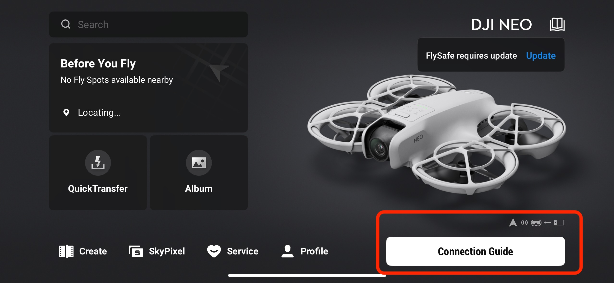
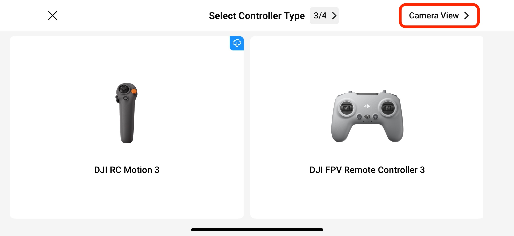
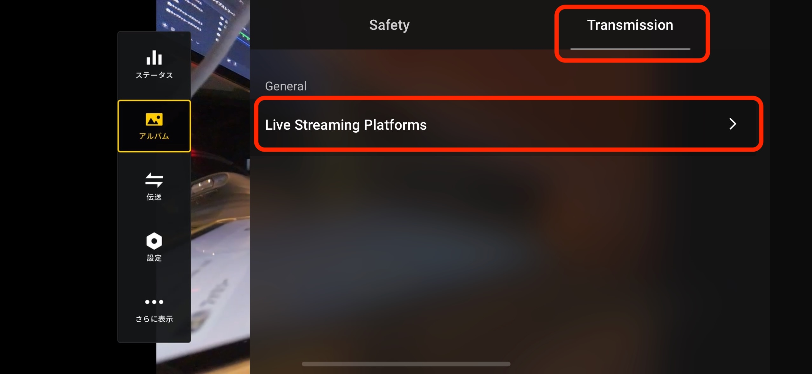
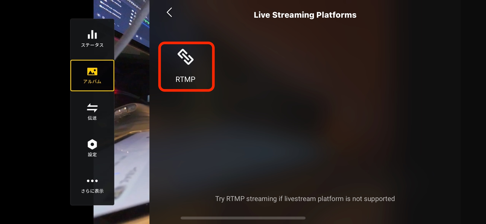
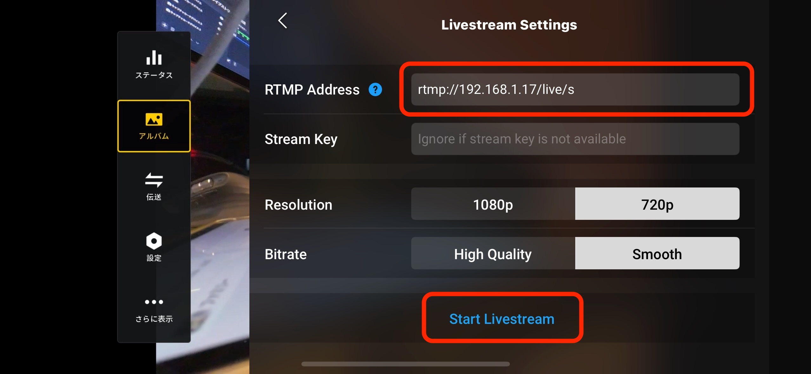
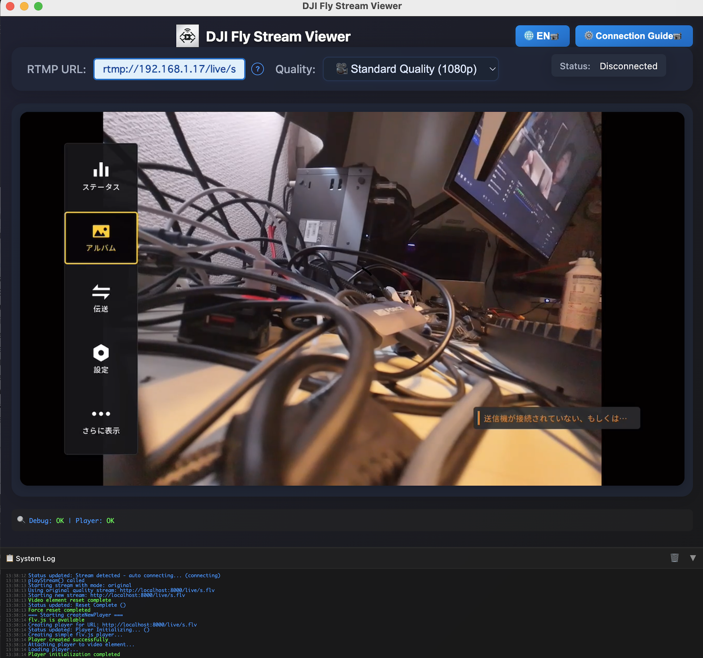

# DJI Fly Stream Viewer

A desktop application for receiving and viewing live streaming from DJI drones on PC. Receives RTMP streaming from DJI Fly app and provides stable viewing experience. This application is designed specifically for DJI devices and RTMP streaming.


## 📑 Table of Contents
- [🎯 Key Features](#-key-features)
- [🚀 Quick Start](#-quick-start)
  - [1. Installation & Launch](#1-installation--launch)
  - [2. Configure DJI Connection](#2-configure-dji-connection)
  - [3. Start Viewing](#3-start-viewing)
- [📋 Detailed Usage](#-detailed-usage)
- [🛠️ System Requirements](#️-system-requirements)
- [📱 Tested Devices](#-tested-devices)
- [🔧 Troubleshooting](#-troubleshooting)
- [🏗️ Development Information](#️-development-information)

## 🎯 Key Features

- **📡 RTMP Stream Reception**: Receives streaming from DJI Fly app and DJI devices
- **🎥 Quality Streaming**: Multiple quality modes for optimal viewing experience
- **📱 DJI Device Support**: Detailed connection guide for all DJI devices included
- **🌐 Web UI**: User-friendly interface with real-time controls
- **⚡ Resolution Conversion**: Real-time resolution adjustment and optimization
- **🔧 H.264 Encoding**: Fixed H.264 encoding errors for stable streaming
- **🤝 DJI Device Support**: Optimized for DJI Neo and O4 Air Unit

## 🚀 Quick Start

### 1. Installation & Launch

#### macOS (Recommended)
1. Download the latest `.dmg` file from [Releases](https://github.com/takatronix/djifly-viewer/releases/latest)
2. Choose the correct version for your Mac:
   - **Intel Mac**: `DJI Fly Stream Viewer-[version].dmg`
   - **Apple Silicon (M1/M2/M3/M4)**: `DJI Fly Stream Viewer-[version]-arm64.dmg`
3. Double-click the downloaded `.dmg` file
4. Drag "DJI Fly Stream Viewer" to the Applications folder
5. Launch "DJI Fly Stream Viewer" from Applications

#### Windows
1. Download `DJI Fly Stream Viewer Setup [version].exe` from [Releases](https://github.com/takatronix/djifly-viewer/releases/latest)
2. Double-click the downloaded `.exe` file
3. Follow the installation wizard
4. Launch "DJI Fly Stream Viewer" from Desktop or Start Menu

### 2. Configure DJI Connection

#### 📋 Preparation
1. **Install DJI Fly app** on your smartphone
2. **Connect DJI device** to smartphone with USB-C cable
3. **Power on DJI device**

#### 📱 DJI Fly App Connection Steps

**Step 1: Launch DJI Fly App**
- Launch DJI Fly app and press the Connection Guide button when it appears



**Step 2: Open Camera View**
- Press the Camera View button in the top right corner



**Step 3: Access Settings**
- When drone preview appears, press the [...] button in the top right corner


**Step 4: Select Live Streaming**
- Click the Transmission tab and select Live Streaming Platforms



**Step 5: Choose RTMP**
- Press RTMP to select custom RTMP streaming



**Step 6: Enter RTMP URL**
- Enter the RTMP URL shown on this app's main screen: `rtmp://[displayed IP address]/live/s`
- Press Start LiveStream



**Step 7: Streaming Success**
- When connection is successful, the drone video will appear on this app's main screen



### 3. Start Viewing

The application will automatically detect the stream and start playback. You can also manually select quality modes from the interface.

## 📋 Detailed Usage

### RTMP Streaming Settings

| Setting | Recommended Value |
|---------|-------------------|
| Resolution | 1080p (High Quality) / 720p (Stability Focus) |
| Bitrate | 2-4 Mbps |
| Frame Rate | 30fps |
| Codec | H.264 |

### Quality Modes

- **🎥 Standard Quality (1080p)**: High quality with optimal stability
- **⚡ Enhanced 720p**: Optimized quality with good performance
- **⚡ Enhanced 480p**: Optimized for lower bandwidth environments

### Resolution Presets

| Resolution | Use Case |
|------------|----------|
| Original | Preserves source quality |
| 720p | Balanced quality and performance |
| 480p | Low bandwidth environments |

## 🛠️ System Requirements

### Minimum Requirements
- **OS**: macOS 10.14+ / Windows 10+
- **CPU**: Intel Core i3 / Apple M1 or equivalent
- **Memory**: 4GB RAM
- **Network**: Wired LAN recommended

### Recommended Requirements
- **OS**: macOS 12.0+ / Windows 11+
- **CPU**: Intel Core i5 / Apple M1 Pro or equivalent
- **Memory**: 8GB RAM
- **Network**: Gigabit Ethernet

## 📱 Tested Devices

### DJI Drones
- **DJI Neo**: Fully tested and supported

### DJI Air Units
- **O4 Air Unit**: Fully tested and supported

### DJI Goggles
- **DJI Goggles 3**: Fully tested and supported
- **DJI Goggles (other models)**: Compatible with standard connection steps

## 🔧 Troubleshooting

### Stream Connection Issues
1. Check firewall settings
2. Verify ports 1935, 8000, 8081 are open
3. Ensure devices are on the same network
4. Try restarting the application

### Video Playback Issues
1. Switch from Wi-Fi to wired connection
2. Lower resolution (720p → 480p)
3. Try standard quality mode instead of enhanced modes
4. Clear browser cache and reload

### Audio Issues
1. Check browser audio settings
2. Verify DJI Fly app audio settings
3. Check system volume settings
4. Ensure audio codec is supported

### Port Usage Check
```bash
# Check ports in use
lsof -i :1935 -i :8000 -i :8081
```

### Log Inspection
```bash
# View application logs (development mode)
npm run electron
# Check console for error messages
```

## 🏗️ Development Information

### Project Structure
```
dji-fly-viewer/
├── electron/          # Electron main process
│   └── main.js
├── public/            # Web frontend
│   ├── index.html
│   ├── app.js
│   ├── style.css
│   ├── connection-guide.html
│   └── app_guide/    # Connection guide images
├── server.js          # Node.js server
├── package.json       # Dependencies & build config
└── dist/             # Built applications
```

### Key Dependencies
- **node-media-server**: RTMP server implementation
- **express**: Web server framework
- **electron**: Desktop application wrapper
- **ffmpeg-static**: Video conversion engine

### Development Commands
```bash
# Install dependencies
npm install

# Start development mode
npm run electron

# Start server only
npm start

# Build macOS DMG
npm run build-mac

# Build Windows installer
npm run build-win

# Build all platforms
npm run build-all
```

### API Endpoints
```
GET  /api/streams        # Active streams list
GET  /api/server-info    # Server information (IP, etc.)
POST /api/stream/resolution/:streamKey/:resolution  # Resolution conversion
POST /api/stream/stop-conversion/:streamKey         # Stop resolution conversion
```

## 📄 License

MIT License

## 🤝 Contributing

1. Fork this repository
2. Create a feature branch (`git checkout -b feature/amazing-feature`)
3. Commit your changes (`git commit -m 'Add amazing feature'`)
4. Push to the branch (`git push origin feature/amazing-feature`)
5. Create a Pull Request

## 📞 Support

### Issue Reporting
- Report issues on [GitHub Issues](https://github.com/takatronix/djifly-viewer/issues)
- Please include the following information in bug reports:
  - OS & Version
  - DJI drone/goggles model
  - Error messages
  - Steps to reproduce

### Feature Requests
- Post feature requests on [GitHub Discussions](https://github.com/takatronix/djifly-viewer/discussions)

## 🔗 Related Links

- [DJI Official Website](https://www.dji.com/)
- [DJI Fly App](https://www.dji.com/downloads/djiapp/dji-fly)
- [DJI Neo](https://www.dji.com/neo)
- [FFmpeg Official Website](https://ffmpeg.org/)
- [Node Media Server](https://github.com/illuspas/Node-Media-Server)

## 📝 Release Notes

See the full release history and download the latest version at [GitHub Releases](https://github.com/takatronix/djifly-viewer/releases/latest).

### Recent Updates
- ✅ **Universal DJI device support**: Support for all DJI devices, not just DJI Goggles 3
- ✅ **Multi-language support**: English/Japanese interface with language preference saving
- ✅ **Enhanced connection guide**: Step-by-step visual guide with actual app screenshots
- ✅ **Cleaner UI**: Removed emojis from buttons for professional appearance
- ✅ **Automatic releases**: GitHub Actions powered build and release system
- ✅ **Fixed DJI compatibility**: Corrected stream URL paths for DJI devices
- ✅ **Enhanced DJI support**: Optimized for DJI Neo and O4 Air Unit
- ✅ **H.264 encoding fix**: Resolved H.264 encoding errors
- ✅ **Stream processing improvements**: Fixed RTMP input URLs for resolution conversion
- ✅ **Cross-platform support**: Windows x64/ia32 and macOS Intel/ARM64

---

**📹 Enjoy your drone streaming with DJI Fly Stream Viewer!**