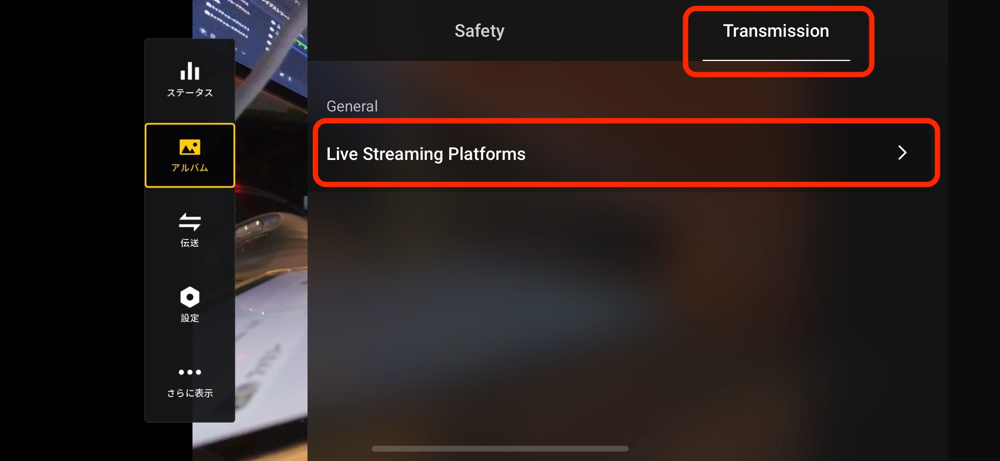
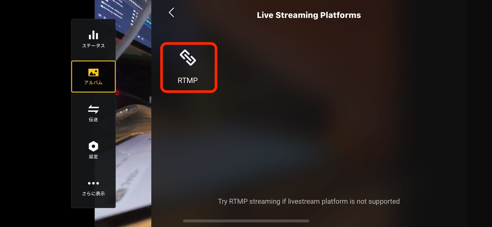

## Step1

ゴーグルとスマートフォンとケーブルで接続してDJI Flyアプリを起動します。
ドローンとゴーグルが接続していると、コネクションガイドのボタンが出るの押します。

## Step2

右上の Camera Viewボタンを押します

## Step3

ドローンのプレビューが表示されたら、右上の[...]ボタンを押します

## Step4

TransmissionタブをクリックしてLive Streaming Platformsを選択します。

## Step5

RTMPを押します。

## Step6

RTMP Addressに、アプリで表示されているURLを入力します。
Start LiveStreamをします

## Step7

接続が成功するとアプリにドローンの映像が表示されます